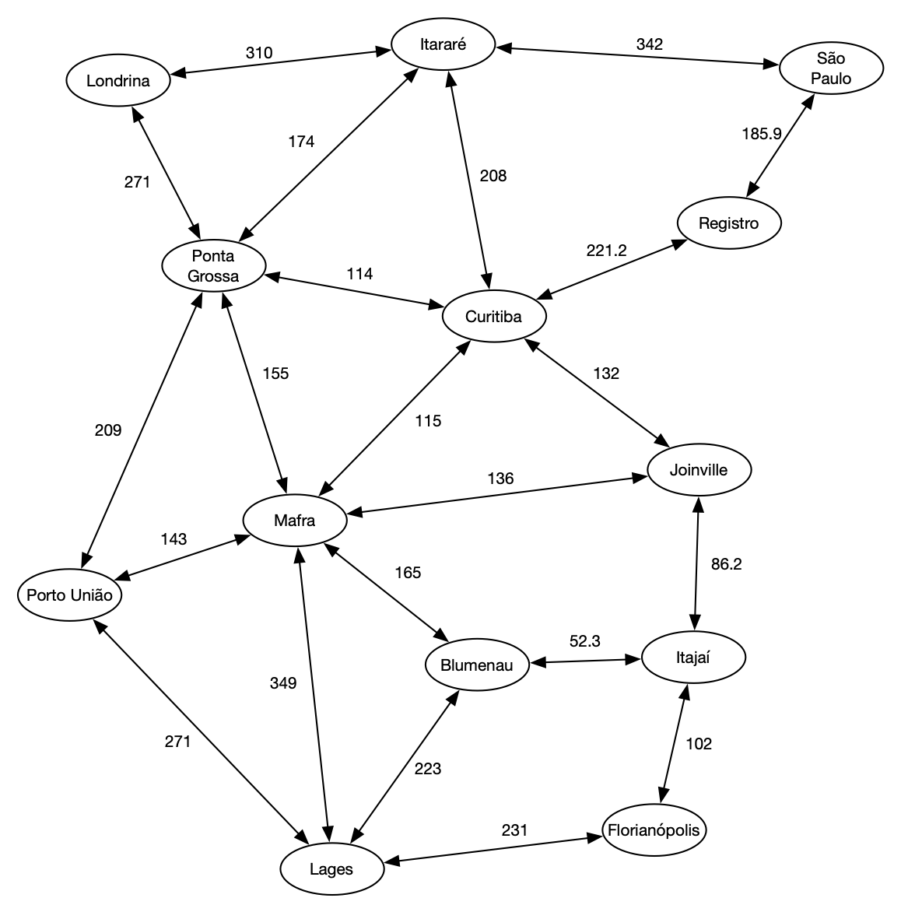

# MenorCaminho_Cidades
Usando a estrutura grafo busca o menor caminho entre duas cidades

# Programação com Estrutura de Dados Avançadas (PEDA)
<pre>Erick Lemmy dos Santos Oliveira 
Entrega 23/11/2021 </pre>
- Projeto Final 
- Estrutura: Grafo 

# Grafo 

# Criterio 
O critério para determinar qual seria este "melhor" caminho pode ser:

- distância (o caminho mais curto);  
- custo (o caminho mais barato);     
- tempo (o caminho mais rápido);     
- etc.  
- ou mesmo uma combinação destes critérios

# Projeto

Este projeto visa, a partir de um grafo com peso representando um mapa qualquer de cidades e suas distâncias (como no exemplo acima), construir em C++ um programa que, dadas 2 cidades A e B (lidas do usuário) mostre na tela: 

- a menor distância; e
- o menor caminho entre A e B.

# Observações 
- A classe Mapa deve ser definida para armazenar o grafo com os nomes das cidades e as distâncias entre elas.
- O mapa deve ser "pré-configurado" no seu programa (ou lido diretamente de um arquivo), ao invés de ser lido do usuário.
- As distâncias entre as cidades são dadas em km.  
- Se existe uma estrada de d km de extensão ligando uma cidade A a uma cidade B, então existe também uma estrada de igual extensão ligando a cidade B à cidade A.
- Use o algoritmo de Dijkstra do menor caminho discutido em aula e disponível no material da disciplina.

